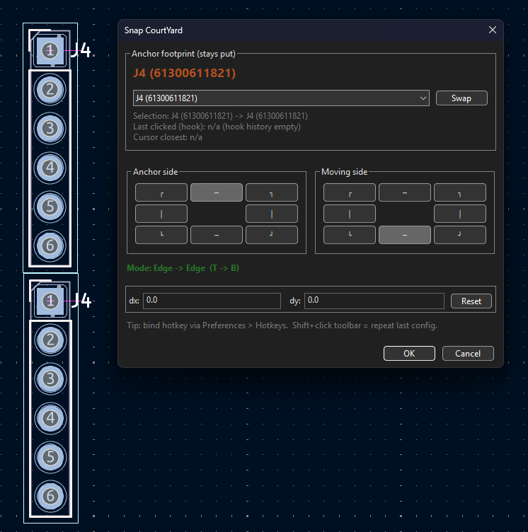

<div align="center">


# SnapCourtYard

**KiCad PCB editor plugin — snap footprints edge-to-edge or corner-to-corner in one click.**

[](LICENSE)
[](https://www.kicad.org/)
[](https://www.python.org/)
[](https://github.com/DevPhantom-Dev/SnapCourtYard/releases)

</div>

---

## ✨ What It Does

Select two or more footprints in **pcbnew**, run the plugin, and they snap together instantly — courtyard boundary touching courtyard boundary, with an optional gap.

> No manual measuring. No calculator. Just select → snap → done.

<div align="center">
  
  <br/>
  <em>The plugin dialog: choose anchor, pick snap edges/corners, set optional offset, click OK.</em>
</div>

---

## 🔧 Snap Modes

| Mode | What happens |
|------|-------------|
| **Edge → Edge** | The moving footprint slides until the chosen edge touches the anchor's edge. Position along the parallel axis is unchanged. |
| **Corner → Corner** | A chosen corner on the anchor meets a chosen corner on the moving footprint exactly. |

Courtyards are built from the merged **F.CrtYd + B.CrtYd** bounding box.  
Falls back to the footprint bounding box when no courtyard polygon is defined.  
✅ Only translation applied — **rotation is always preserved**.

---

## 📦 Installation

### Option A — Plugin and Content Manager *(recommended)*

1. Grab the latest `.zip` from the [**Releases**](https://github.com/DevPhantom-Dev/SnapCourtYard/releases) page,  
   **or** build it yourself:
   ```bash
   python build_pcm.py
   # → dist/SnapCourtYard-1.9.0-pcm.zip
   ```
2. Open KiCad → **Plugin and Content Manager → Install from File…** → select the zip.
3. Click **Apply Changes**.  
   The toolbar button appears in pcbnew immediately (or use **Tools → External Plugins → Refresh**).

### Option B — Manual copy

Copy the `SnapCourtYard/` folder to your KiCad scripting plugins directory:

| 🖥️ OS | 📂 Path |
|--------|--------|
| **Windows** | `%APPDATA%\kicad\<ver>\scripting\plugins\SnapCourtYard` |
| **Linux** | `~/.local/share/kicad/<ver>/scripting/plugins/SnapCourtYard` |
| **macOS** | `~/Documents/KiCad/<ver>/scripting/plugins/SnapCourtYard` |

> Replace `<ver>` with your KiCad version — e.g. `8.0` or `7.0`.  
> Then restart KiCad or use **Tools → External Plugins → Refresh**.

---

## 🚀 Usage

```
1. Open a PCB in pcbnew
2. Select 2+ footprints
3. Click the Snap CourtYard toolbar button
   (or Tools → External Plugins → Snap CourtYard)
4. Pick snap mode, edges / corners, and optional dx/dy offset
5. Click OK
```

The **anchor footprint stays fixed**. All other footprints are translated so their courtyard edge/corner meets the anchor's chosen edge/corner.

---

## 🗂️ Project Structure

```
SnapCourtYard/
├── SnapCourtYard/                  # Plugin package
│   ├── __init__.py                 # Registers the plugin with KiCad
│   ├── snap_courtyard_action.py    # ActionPlugin subclass + wxPython dialog
│   └── snap_logic.py              # Bbox math — no wx/KiCad deps, easily testable
├── images/
│   └── snap_courtyard_dialog.png  # Screenshot used in this README
├── pcm/
│   ├── metadata.json              # KiCad PCM package metadata
│   └── resources/icon.png         # Plugin toolbar icon
├── dist/                          # Built release archives
├── build_pcm.py                   # Produces PCM-compatible .zip
└── plugins.pdf                    # KiCad C++ plugin reference (informational)
```

---

## 🔨 Building a Release

```bash
python build_pcm.py
```

Reads the version from `pcm/metadata.json` and writes `dist/SnapCourtYard-<version>-pcm.zip`.

---

## 📋 Requirements

- KiCad **7.0 or later** (tested on 7.x, 8.x, 10.x)
- Python 3 *(bundled with KiCad — nothing extra to install)*

---

## 📄 License

Released under the **MIT License** — see [`LICENSE`](LICENSE) for details.
